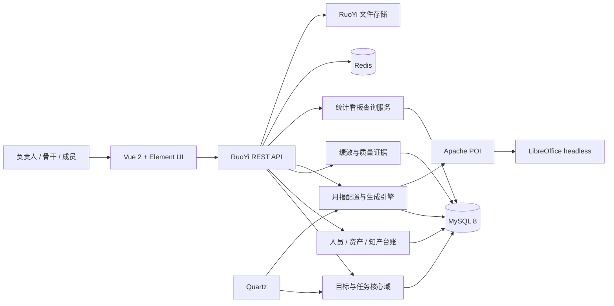
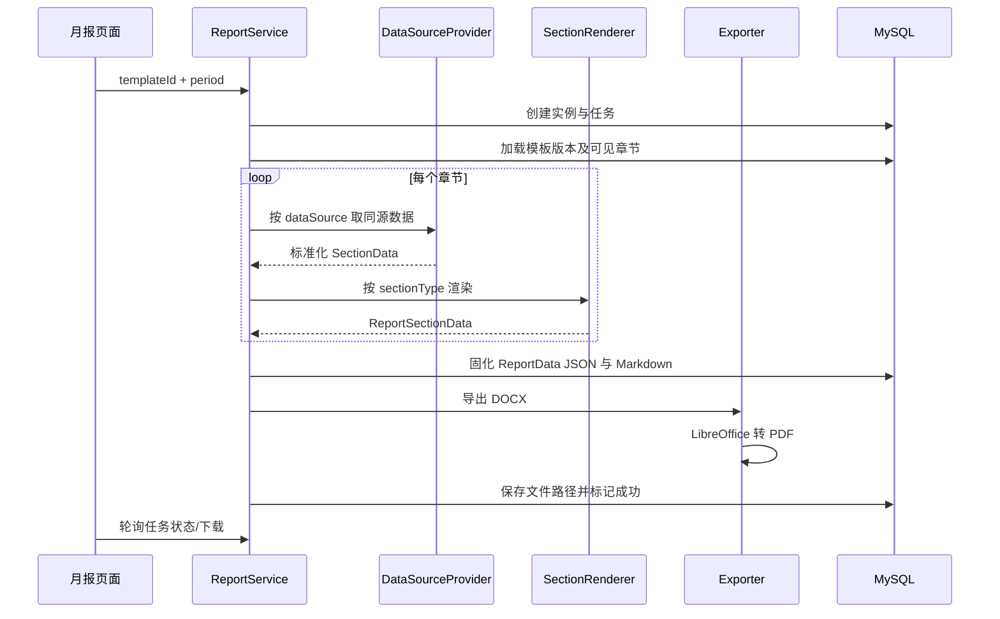

# 人工智能实验室管理系统设计规格

日期：2026-08-06  
状态：待实施  
适用范围：技术研发中台（算法、开发、硬件三条业务线，约 6 人）

## 1. 目标与成功标准

本系统用一份可信的业务数据同时支撑日常管理、统计看板、绩效反馈和月报生成。成员只在工作发生时维护目标、任务、交付证据和必要小结，不在月末二次抄写。

成功标准：

1. 负责人打开首页即可看到目标偏差、逾期任务、阻塞升级、成员负载、资产单点风险和待填事项。
2. 成员能在 3 分钟内完成一周 3—5 项任务的创建或状态更新；表单只显示当前状态必需的字段。
3. 年度目标、季度里程碑、月任务、周任务可连续下钻，任一交付能追溯负责人、资产和证据。
4. 月报由同源数据自动生成，人工只补充原因分析、下一步策略和业务线小结。
5. 月报模板支持配置、复制、启停章节、导入导出 JSON，并能输出 Markdown、Word 和 PDF。
6. 部门负责人、业务线骨干、普通成员的数据权限符合最小授权原则，普通成员无法读取他人绩效。
7. 系统可用标准 RuoYi-Vue 3.8.x 方式编译、初始化和部署，不依赖新增中间件。

## 2. 方案比较与决策

### 方案 A：RuoYi-Vue 模块化单体（采用）

在 RuoYi-Vue `v3.8.9`（官方标签提交 `5e6c917ab0c29536b6ca792475c6611ebe0cea85`）中新增 `ruoyi-lab` 业务模块，复用用户、部门、角色、字典、文件、Quartz、日志和数据权限能力。前端仍为 Vue 2 + Element UI。基线以该提交固定，不跟随上游漂移。

优点是符合参考约束、部署简单、事务边界清晰、6 人团队维护成本最低；不足是月报生成等重任务与 CRUD 共用进程。首期通过异步任务状态、临时文件清理和限流控制，不为小团队引入消息队列。

### 方案 B：微服务拆分

将月报、绩效、任务拆成服务。隔离性更强，但会引入注册中心、网关、分布式事务和运维复杂度，明显超出当前规模，否决。

### 方案 C：先做低代码台账再迁移

验证成本低，但用户要求直接交付完整系统，且后续迁移会形成两套数据和二次建设，否决。

## 3. 总体架构

系统采用前后端分离的模块化单体架构：



后端模块：

- `ruoyi-admin`：启动、认证和系统级接口。
- `ruoyi-framework` / `ruoyi-system`：复用权限、数据范围、字典、用户、部门和日志。
- `ruoyi-quartz`：待填提醒、阻塞升级、临时文件清理。
- `ruoyi-lab`：全部实验室业务领域代码。
- `ruoyi-common`：仅放真正跨模块的通用能力，业务规则不得下沉到公共模块。

`ruoyi-lab` 内按 `goal`、`task`、`member`、`asset`、`ipr`、`performance`、`report`、`dashboard` 分包。Controller 只做参数校验与权限入口，Service 管理业务规则和事务，Mapper 负责持久化，月报通过 Provider/Renderer/Exporter 扩展点解耦。

## 4. 核心业务主线

目标树的逻辑层级为：

```text
年度目标（lab_goal）
└─ 季度里程碑（lab_goal.parent_id）
   └─ 月度考核任务（lab_task.milestone_id）
      └─ 周任务（lab_task.parent_id）
```

为解决参考方案中“`lab_task.parent_id` 既指任务又指目标”的外键歧义，物理模型明确为：

- `lab_goal.parent_id` 只关联 `lab_goal.id`，年度目标为空，季度里程碑指向年度目标。
- `lab_task.parent_id` 只关联 `lab_task.id`，周任务指向月任务，月任务为空。
- `lab_task.goal_id` 冗余保存年度目标 ID，便于按年度目标统计；`milestone_id` 保存季度里程碑 ID。
- 新增/变更任务时由服务层校验层级并维护年度目标映射，不允许跨年度或跨负责范围错误挂接。

任务是事实中心：目标完成率、成员负载、交付得分、阻塞预警和月报数据都从任务及证据表聚合，不建立重复统计表。仅在报告实例中固化生成时快照，保证历史报告不因源数据后改而变化。

## 5. 数据模型

所有业务表统一包含 `id bigint`、`del_flag char(1)`、`create_by`、`create_time`、`update_by`、`update_time`、`remark`；全部字段带注释，状态/周期/负责人/父级字段建立组合或单列索引。枚举通过 `sys_dict_type/sys_dict_data` 管理，数据库保存稳定字典值。

### 5.1 目标与任务

| 表 | 作用 | 关键字段/约束 |
|---|---|---|
| `lab_goal` | 年度目标、季度里程碑 | `parent_id`、`goal_level`、`year`、`period`、`goal_no`、`title`、`target_value`、`accept_criteria`、`owner_id`、`weight`、`progress_rate`、`status`；同年度 `goal_no` 唯一 |
| `lab_task` | 月任务、周任务 | `parent_id`、`goal_id`、`milestone_id`、`task_level`、`period`、`biz_line`、`task_type`、`owner_id`、`plan_date`、`deliverable`、`perf_weight`、`goal_weight`、`workflow_status`、`result_status`、结果/原因/协调/阻塞字段、`asset_id`；`version` 用于乐观锁 |
| `lab_task_evidence` | 一项任务的多份证据 | `task_id`、`evidence_type`、`evidence_name`、`evidence_url`、`verified_flag`；完成任务至少一条有效证据 |
| `lab_task_quality_gate` | 质量门禁 | `task_id`、`gate_type`（需求/方案/提测/发布）、`passed_flag`、`evidence_id`、`score`；有证据且通过才计分 |
| `lab_task_block_event` | 阻塞发生与解除历史 | `task_id`、`episode_no`、`block_start_time`、`block_end_time`、`block_reason`、`resolution`、`escalation_level`；任务+序号唯一 |
| `lab_reminder` | 可读、可幂等的定向提醒 | 业务类型/ID、提醒类型、等级、接收人、提醒日期、标题、内容、已读状态、`idempotency_key` 唯一 |

目标进度默认按子项权重自动汇总；负责人可填写进展说明，但不能直接绕过子项修改自动进度。无子项时允许维护目标自身进度，添加子项后切换为自动汇总。`perf_weight` 仅用于个人月度绩效，同一成员同一月份的重点月任务合计必须为 100；`goal_weight` 仅用于里程碑进度，同一里程碑下全部重点月任务合计必须为 100，两套权重不能混用。

### 5.2 三本台账与人员维护

| 表 | 作用 | 关键字段/约束 |
|---|---|---|
| `lab_asset` | 硬件/算法/平台资产 | 类型、名称、版本、阶段、主责人、备份人、测试集/部署包/文档链接、复用次数、状态；主责人与备份人不能相同 |
| `lab_member` | 成员业务档案 | `sys_user_id` 唯一、岗位、业务线、主责、备份职责、入组日期、在岗状态；姓名来自 `sys_user`，不重复维护身份信息 |
| `lab_skill` | 可维护的技能目录 | 技能名称、分类、描述、状态 |
| `lab_member_skill` | 可统计的能力矩阵 | 成员、技能、等级 1—5、最近验证日期、证据链接；成员+技能唯一。采用规范化表替代难查询的 JSON 技能矩阵 |
| `lab_one2one` | 1 对 1 记录 | 成员、日期、事实证据、困难、下一步、负责人评论；仅负责人及本人可见 |
| `lab_ipr` | 软件著作权/专利/认证 | 类型、名称、负责人、阶段、计划/实际提交日期、受理号、证书号、状态 |

成员页提供“基础档案 + 能力矩阵 + 主备职责 + 近期任务 + 1 对 1”的单页维护体验。新增成员从现有系统用户选择，避免账号与成员重复创建；离组采用停用而非删除，保留历史任务和报告。

### 5.3 绩效与协同

| 表 | 作用 | 关键字段/约束 |
|---|---|---|
| `lab_collaboration_record` | 协同事实 | 成员、周期、类型（跨部门/知识沉淀/备份培养/逾期扣分）、分值、说明、证据 URL |
| `lab_perf_score` | 月度评分与季度校准 | 成员、周期、交付/质量/协同/总分、红线、负责人评论、校准分、状态；成员+周期唯一 |

月度分数由系统计算并保留计算明细 JSON 快照。公式为：交付 60 + 质量 25 + 协同 15。交付分按重点任务权重和完成系数计算；质量分读取四道质量门禁；协同分读取协同事实并应用上下限。红线来自无证据交付或关键资产无合格备份人，必须由负责人确认后定稿。月度分用于反馈，不提供横向排名；季度校准只允许负责人操作并记录日志。

### 5.4 月报引擎

| 表 | 作用 | 关键字段/约束 |
|---|---|---|
| `lab_report_template` | 模板版本 | 名称、逻辑编码 `template_code`、`revision_no`、报告类型、页眉 JSON、样式 JSON、默认标志、最新标志、状态；逻辑编码+修订号唯一 |
| `lab_report_section` | 可配置章节 | 模板、排序、标题层级、章节类型、数据源、筛选/列配置 JSON、分组字段、人工标志、模板文本、可见标志、敏感权限 |
| `lab_report_summary` | 必要的人工小结 | 周期、业务线、章节、原因分析、下一步策略、小结正文；同周期+业务线+章节唯一 |
| `lab_report_instance` | 报告版本归档 | 精确模板版本、周期、实例版本号、生命周期状态、当前定稿标志、敏感标志、`report_data_json`、Markdown 正文、各制品路径/状态/错误、来源（自动/导入 Markdown）、生成人和时间；模板+周期+实例版本唯一 |
| `lab_report_job` | 可重试生成步骤 | 实例、步骤类型（数据/Word/PDF）、状态、进度、尝试次数、错误摘要、开始/结束时间；避免长时间 HTTP 阻塞并支持单制品重试 |

JSON 配置在导入和保存时按白名单 Schema 校验；模板文本只开放预定义变量和安全内建函数，不允许访问任意 Java 对象。`template_code` 表示模板家族：编辑已发布模板时以相同编码创建递增修订，另存为新模板时创建新编码且修订号从 1 开始。报告实例永远引用精确修订。每种 `report_type` 只能有一个“默认且最新的启用修订”，由服务层事务切换；修改配置不追溯影响旧报告。

## 6. 关键流程与状态规则

### 6.1 周/月任务维护

1. 成员基于当月任务快速复制或新建本周 3—5 项任务。
2. 表单按结果渐进显示：完成时展示结果与证据，未完成时展示原因与下步行动，需协调时展示协调字段。
3. 提交时后端统一返回字段级错误列表；前端定位并高亮，不只弹出笼统错误。
4. 月度重点任务计划激活前校验本人该周期 `perf_weight` 合计等于 100；里程碑激活前校验直接月任务 `goal_weight` 合计等于 100。
5. 周任务进度汇总到月任务，月任务汇总到目标；服务层事务内更新或在查询时聚合，禁止客户端传入最终统计值。

任务使用工作流状态与结果状态两个正交字段：

| 工作流状态 | 含义 | 允许操作 |
|---|---|---|
| `DRAFT` | 计划草稿 | 负责人可编辑/删除；月任务可提交计划 |
| `ACTIVE` | 计划已激活、执行中或退回后修改 | 负责人更新进展、结果、证据、阻塞；可提交结果 |
| `PENDING_REVIEW` | 结果待审核 | 内容锁定；负责人可在审核前撤回到 `ACTIVE` |
| `CONFIRMED` | 结果已确认 | 不可编辑；只能由部门负责人按审计流程重开到 `ACTIVE` |

结果状态为 `DOING`、`EXCEEDED`、`ONTIME`、`DELAYED`、`UNDONE`。激活时为 `DOING`；提交结果时，`UNDONE` 由负责人明确选择，其他完成结果中 `EXCEEDED` 需要审核人确认，`ONTIME/DELAYED` 由服务端比较实际完成时间与计划日期得出，客户端不能伪造。`提交计划` 是 `DRAFT → ACTIVE`，`提交结果` 是 `ACTIVE → PENDING_REVIEW`，审核通过是 `PENDING_REVIEW → CONFIRMED`，退回是 `PENDING_REVIEW → ACTIVE`。

普通成员或任务负责人可维护本人任务；业务线骨干可审核本业务线其他成员的任务；部门负责人可审核全部任务。任何人不得审核自己的任务，若业务线只有一人则由部门负责人审核。证据上传者不能自行把 `verified_flag` 设为 1；审核通过时审核人逐项确认。月/周提醒只针对 `DRAFT`、`ACTIVE` 中尚未完成必填项的任务。

强制规则：

- 按时/延期完成：`result_desc` 必填，且至少一条有效证据。
- 未完成：`fail_reason`、`next_action` 必填。
- `need_coord=1`：协调部门、内容、所需支持必填。
- `block_flag=1`：首次标记自动记录开始时间；解除时记录解除时间但不抹除历史事实。
- 权重仅对月度重点任务生效，日常工作和周任务不参与 100% 校验。

审核通过前，完成类任务至少有一条已验证证据；未完成任务必须有原因和下步行动。计划日期、归属目标、两套权重或负责人变更会使既有结果退回 `ACTIVE` 并重新审核。

### 6.2 计算合同

计算只读取 `CONFIRMED` 结果；未到期的 `ACTIVE` 任务不按未完成计分，到周期截止仍未提交的任务按 `UNDONE` 计入绩效并生成逾期协同扣分记录。

- **个人交付分（0—60）**：`Σ(本人当月重点任务 perf_weight × 完成系数) × 0.6`。完成系数为超预期 1.2、按时 1.0、延期 0.7、未完成 0；交付分封顶 60，超预期用于抵消同月其他损失而不突破上限。
- **质量分（0—25）**：每个重点月任务至少配置一个适用质量门禁。单任务质量率=`已通过且有验证证据的适用门禁数/适用门禁数`；总分=`25 × Σ(perf_weight × 单任务质量率)/100`。
- **协同分（0—15）**：已审核且有证据的跨部门支撑最多 6 分、知识沉淀最多 5 分、备份培养最多 4 分；逾期未填等负向记录在三类正向合计后扣减，最终按 0—15 截断。记录分值由负责人确认并写操作日志。
- **红线**：周期关闭时重点交付没有已验证证据，或关键资产无在岗备份人且当季无备份培养记录，触发 `red_line_flag=1`。数字分仍保留作诊断，但绩效结果标记为 `RED_LINE`；只能由部门负责人基于纠错证据撤销，不能用校准分覆盖。
- **季度校准**：不自动排名、不自动取三个月平均。负责人读取三个月明细后填写 0—100 的 `calibrate_score` 和必填评语；存在未撤销红线时不能标记正常校准结果。
- **里程碑进度**：`Σ(月度重点任务 goal_weight × progressCoefficient)/100`，其中已确认超预期/按时为 1、延期为 1、未完成为 0，执行中按已确认周任务完成比例计算并限制在 0—1。年度目标进度=`Σ(季度里程碑 weight × 里程碑进度)/100`。年度目标下季度里程碑权重合计必须为 100。
- **健康度**：期望进度为当前日期前计划到期子项的权重累计。实际进度落后期望不超过 5 个百分点且无严重风险为绿色；落后大于 5 且不超过 15 个百分点、存在 7—14 天阻塞或延期重点任务为黄色；落后超过 15 个百分点、阻塞超过 14 天或存在逾期未提交重点任务为红色，风险颜色取最严重值。
- **成员负载**：不构造不可解释的综合分。看板并列展示当月重点任务权重、执行中任务数、近两周周任务数、阻塞数和逾期数；热力颜色以重点任务权重区间（≤80/81—100/>100）为主，阻塞或逾期另加风险标识。

### 6.3 阻塞和待填提醒

任务每次从未阻塞切换为阻塞时创建新的 `lab_task_block_event`；解除时关闭本次事件，重复阻塞产生新序号，历史不可覆盖。`lab_task.block_flag/block_start_time` 只作为当前状态冗余字段。Quartz 每日运行幂等扫描：当前阻塞超过 7 天向任务负责人生成一级提醒，超过 14 天向部门负责人生成二级提醒和红色预警。`lab_reminder.idempotency_key` 使用“提醒类型+业务 ID+事件序号+等级+接收人+日期”，保证同一天同一对象同一级别只生成一次，同时保留接收人和已读状态。月末前 3 天生成本人待填清单，前 1 天将未填汇总给部门负责人。首期使用若依站内通知和看板待办，不接入外部消息平台。

### 6.4 月报生成



扩展接口：

- `DataSourceProvider#supports(String)` 与 `load(ReportContext, SectionConfig)`。
- 内置 `GOAL_PROGRESS`、`TASK_DETAIL`、`TASK_STAT`、`TASK_UNDONE`、`TASK_NEXT`、`TASK_COORD`、`TASK_BLOCK`、`ASSET_SUMMARY`、`IPR_SUMMARY`、`PERF_SUMMARY`、`MANUAL_SUMMARY` Provider。
- `SectionRenderer` 分别实现 `TABLE`、`STAT`、`TEXT`、`MANUAL`、`GROUP_TEXT`、`CHART`。
- `ReportExporter` 实现 JSON、Markdown、Word；PDF 由 Word 结果转换。JSON 是可复用中间结构，不只是调试日志。

报告实例生命周期为 `DRAFT → FINALIZED → SUPERSEDED`。新生成或 Markdown 回编都创建 `DRAFT` 新版本；定稿要求 JSON、Markdown、Word、PDF 四类制品均为 `SUCCESS`，之后内容与文件不可变；新版本定稿时，原当前定稿版本转为 `SUPERSEDED`，但仍可下载。

每类制品独立保存 `PENDING/SUCCESS/FAILED/NOT_REQUESTED` 状态、路径与错误。数据构建成功即同时得到 JSON 与 Markdown；Word 依赖 Markdown；PDF 依赖 Word。某一步失败不回滚已成功制品：例如 PDF 失败时 JSON/Markdown/Word 保持成功，用户可下载但不能定稿。重试只重跑失败制品及其下游，成功制品除非明确“重新生成新版本”不得覆盖。`lab_report_job` 按实例+步骤记录每次尝试；同实例同一步骤用 Redis 短锁和数据库状态双重防重。

错误摘要面向用户，详细堆栈只进入服务端日志；重复生成创建新实例版本，不覆盖定稿。临时文件在成功归档或失败后由定时任务清理，归档制品不在清理范围内。

Markdown 回编只允许修改正文内容，不允许借 Markdown 修改模板权限或数据源；导入后创建来源为 `MANUAL_IMPORT` 的新报告版本，再生成 Word/PDF。

## 7. 前端信息架构与交互设计

主导航按管理动作而非数据表组织：

1. **工作台**：我的待办、今日风险、目标健康度、任务趋势、成员负载、资产单点、最近报告。
2. **目标与任务**：目标树、月任务、周任务、阻塞与协调。
3. **团队与资产**：成员档案、能力矩阵、技术资产、知识产权。
4. **绩效反馈**：我的反馈、月度计算、季度校准（按权限显示）。
5. **报告中心**：报告生成、历史版本、人工小结、模板设计器。

负责人看板默认只呈现需要行动的信息，指标严格采用第 6.2 节计算合同：

- 第一行 5 个指标：年度目标健康度、当月重点任务完成率、逾期/未填、阻塞超过 7 天、无备份资产。
- 中部：目标进度趋势与任务状态分布；点击图形进入已带筛选条件的明细页。
- 下部：成员负载热力图、待协调事项、最近到期知产和报告状态。
- 所有指标显示统计周期、口径说明和最后更新时间，避免“有数字但不知道怎么算”。

成员维护采用主从详情抽屉：列表快速筛选业务线/状态，点击成员打开宽抽屉，分区编辑岗位职责、能力矩阵、主备资产、近期任务与 1 对 1；常用操作不跳转多页。能力矩阵支持行内选择等级和批量保存。

模板设计器采用三栏布局：左栏章节树（Element UI `el-tree` 原生拖拽），中栏章节配置，右栏 Markdown 实时预览；顶部提供保存、另存、设默认、导入、导出、生成测试报告。数据源变化时自动重置不兼容字段并给出明确提示。无需新增前端拖拽依赖。

视觉采用稳重的深靛蓝与青绿色状态色，密度适合桌面管理后台；告警颜色仅表示确需行动的异常。表格保留列显示设置、固定操作列、空状态行动入口和批量操作，避免信息堆积。

## 8. API 与权限边界

接口遵循 `/lab/{domain}`，使用 RuoYi `AjaxResult` 与 `TableDataInfo`。主要权限：

- `lab:dashboard:view`
- `lab:goal:list/add/edit/remove`
- `lab:task:list/add/edit/submit/remove`
- `lab:member:list/edit/one2one`
- `lab:asset:list/add/edit/remove`
- `lab:ipr:list/add/edit/remove`
- `lab:perf:view/score/calibrate`
- `lab:template:list/config/import/export`
- `lab:report:list/generate/download/finalize`

授权矩阵如下；“本线”按成员 `biz_line`，“本人”按登录用户映射的 `lab_member`：

| 资源 | 部门负责人 | 业务线骨干 | 普通成员 |
|---|---|---|---|
| 目标/里程碑 | 全部读写、激活、终止 | 全部读取；编辑本人负责的里程碑，不得改年度权重 | 全部读取 |
| 任务/证据/阻塞 | 全部读写审核 | 本线读写，审核本线他人任务 | 本人读写，不可审核 |
| 成员基础档案 | 全部读写、停用 | 全部基础信息读取，本线成员职责读取 | 全部姓名/岗位/业务线读取，本人职责读取 |
| 技能矩阵 | 全部读写 | 本线读取，本人编辑 | 本人读取和编辑 |
| 1 对 1 | 全部读写 | 仅本人作为谈话对象的记录 | 仅本人记录只读 |
| 资产/知产 | 全部读写 | 全部读取，本线或本人负责记录读写 | 全部读取，本人负责记录编辑 |
| 协同记录 | 全部读写审核 | 本线读取，本人记录创建 | 本人读取和创建，不能审核 |
| 绩效/校准 | 全部读取、计算确认、校准 | 仅本人读取 | 仅本人读取 |
| 人工小结 | 全部读写 | 本线读写 | 无权限 |
| 模板 | 全部读写、发布、默认切换 | 无权限 | 无权限 |
| 报告生成/定稿 | 全部操作 | 无权限 | 无权限 |
| 报告历史 | 全部版本下载 | 非敏感的已定稿版本读取/下载 | 非敏感的已定稿版本读取/下载 |
| 看板 | 全部门口径 | 本线口径 | 个人工作台口径 |

所有列表与导出都在服务/Mapper 层应用数据范围，禁止仅靠前端隐藏。报告实例在生成时根据所含 `PERF_SUMMARY` 或章节敏感权限固化 `sensitive_flag`；敏感实例无论是否定稿，其在线查看、Markdown/Word/PDF 下载和历史版本接口都要求 `lab:report:sensitive`，默认仅部门负责人拥有。删除模板权限不能推导出报告下载权限，所有文件下载必须重新执行实例级鉴权。

文件下载按业务对象再次鉴权，不暴露任意服务器路径。模板 JSON、Markdown 和文件名做大小、后缀、路径穿越与内容校验。操作日志覆盖绩效定稿、季度校准、模板变更、报告生成/定稿和成员停用。

## 9. 错误处理与一致性

- 业务校验使用统一异常和结构化 `fieldErrors`，前端可定位字段。
- 修改任务、模板和报告定稿使用版本号防止覆盖他人更新。
- 目标/任务/绩效更新在本地事务中完成；文件生成采用“数据库任务状态 + 可重试文件步骤”，不把 LibreOffice 调用放在长事务内。
- Provider 返回空数据时渲染明确的空章节或按配置隐藏，不以空指针中止整份报告。
- PDF 环境缺失时保留成功的 Markdown/Word，并把 PDF 标记为可重试失败；管理页显示诊断信息。
- 所有定时任务幂等，重复执行不重复扣分、不重复生成同级提醒。

## 10. 测试与验收

### 10.1 自动化测试

- Service 单元测试：任务条件必填、权重 100、目标层级、主备人冲突、绩效公式、权限敏感 Provider。
- Mapper 集成测试：按负责人/业务线/周期查询、逻辑删除、目标和任务聚合。
- 月报契约测试：每个 Provider 输出字段与 Schema 一致；每个 Renderer 对空数据和中文内容稳定。
- 导出测试：固定 `ReportData` 生成 Markdown/Docx，检查中文字体、标题层级、重复表头和关键文本；有 LibreOffice 的环境执行 PDF 冒烟测试。
- 前端测试以构建检查、核心工具函数测试和关键页面手工验收为主，符合 Vue 2 基线，不额外引入大型测试框架。

### 10.2 端到端验收数据

初始化 6 名演示成员、3 条业务线、年度目标及季度里程碑、当月和当周任务、3 类资产、知产、能力矩阵、协同记录和一套标准月报模板。验收路径：

1. 成员提交周任务，验证状态联动与字段级错误。
2. 负责人从看板发现阻塞/未填，进入筛选后的任务详情。
3. 系统聚合目标进度、成员负载和绩效草稿。
4. 负责人填写业务线小结，一键生成 JSON、Markdown、Word、PDF。
5. 修改 Markdown 后导入，生成新版本并定稿；旧版本仍可下载。
6. 使用普通成员账号验证无法查看他人绩效、1 对 1 和敏感报告章节。

## 11. 部署和运行约束

开发与生产均需要 JDK 8/11（按 RuoYi 3.8.x 基线）、Maven、Node.js 兼容版本、MySQL 8、Redis。PDF 功能额外安装 LibreOffice，并通过配置项指定可执行文件和超时时间。文件目录、临时目录和导出大小限制均外置配置。

交付包括：完整源码、建表/菜单/字典/演示数据 SQL、配置样例、部署说明、自测清单、默认月报模板和由演示数据生成的完整月报样例。任何功能不以 TODO 或伪实现占位；若运行环境没有 LibreOffice，仅允许 PDF 集成测试被条件跳过，功能代码必须完整。

## 12. 实施顺序

1. 建立 RuoYi-Vue 3.8.x 基线和 `ruoyi-lab` 模块。
2. 完成全量 SQL、字典、菜单、演示用户映射与默认模板。
3. 打通目标—任务—证据—看板最小闭环。
4. 完成人员、能力、资产、知产、1 对 1 和协同台账。
5. 完成绩效计算、权限隔离和季度校准。
6. 完成月报 Provider、Renderer、Exporter、版本归档与定时清理。
7. 完成各业务页面、负责人看板、成员维护和模板设计器。
8. 执行自动化测试、前后端构建、演示数据验收和部署文档核验。
